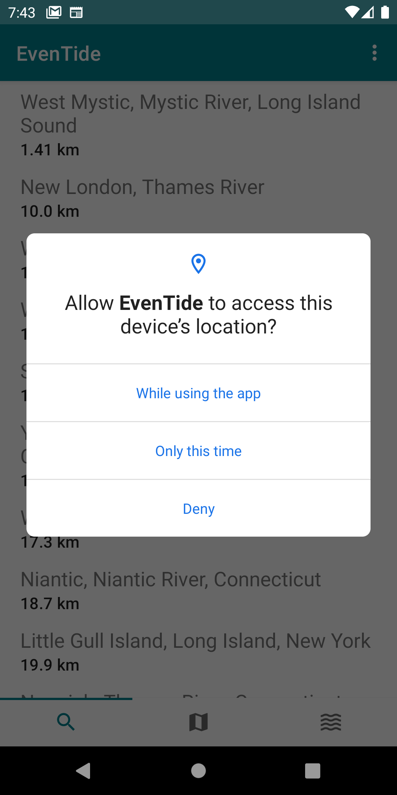
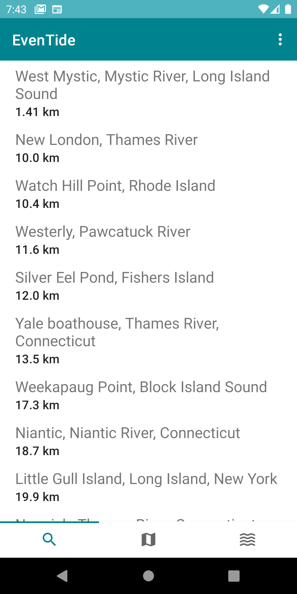
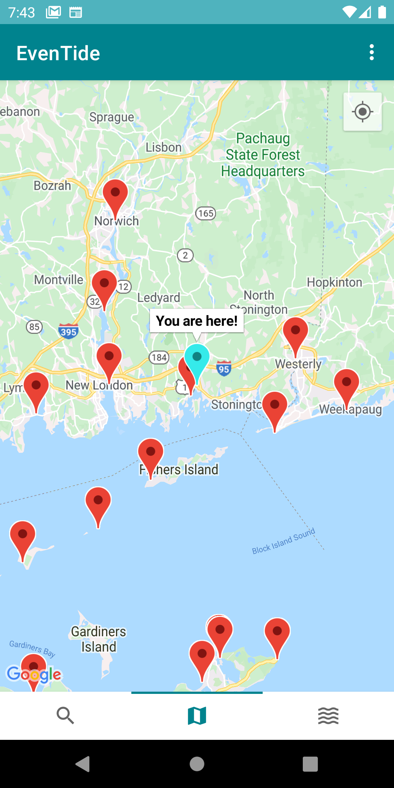
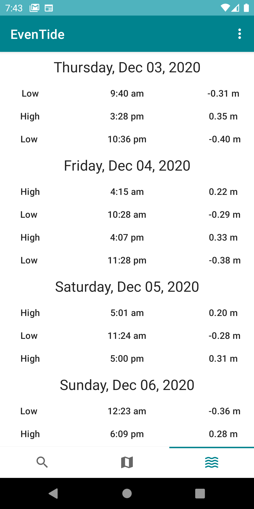
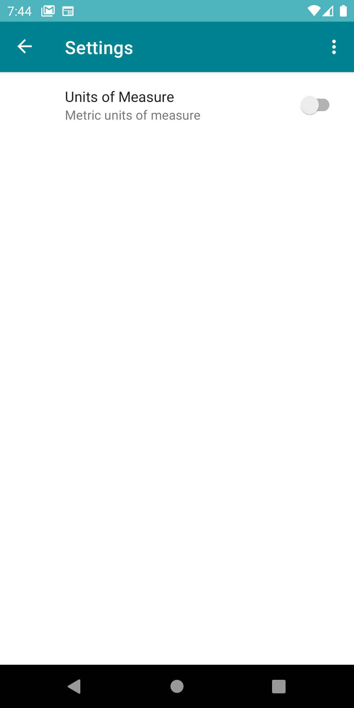
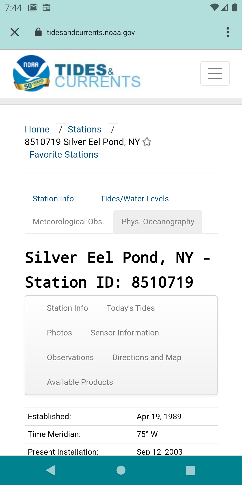

<p align = "center">
  
  </p>

<p align = "center">
  <a href="#description">Description</a> -
  <a href="#tech">Tech</a> -
  <a href="#screenshots">Screenshots</a> -
  <a href="#license">License</a>
  </p>


# Description

  EvenTide is meant to provide boaters with a quick snapshot of relevant
  tidal data in a user-friendly way with as little effort and input from
  the user as possible. For users that would like to dig deeper into the
  forecasts and sensory data collected by tide-stations, the app aims to
  provide an expedient and obvious route to such information. EvenTide
  fetches information from the
  [WorldTides API](https://www.worldtides.info/apidocs) and then relies
  on [NOAA](https://tidesandcurrents.noaa.gov/) for realtime and
  forcasted tidal data based on station location.

# Tech
<h5>Material Design</h5> For predictable, well-designed and
aesthetically pleasing user interfaces.
<h5>Retrofit2</h5> REST Client that helps make dynamic queries and network requests to retrieve
 and upload JSON.
<h5>Room</h5> A persistence library that provides an abstraction layer over SQLite to assist
 in storing and retrieving lists of tide and tide station data after a network
request. This enables it to remain a reliable source of information even offline.
<h5>LiveData</h5> Used to emit and observe streams of data in realtime to update the UI while remaining
LifeCycle aware.
<h5>Coroutines</h5> Asynchronous operations handled by Kotlin Coroutines. Keeping database queries and
other heavy lifting off of the main thread for an uninterrupted user experience while also
reducing the need for callbacks.
<h5>Dagger Hilt</h5> A fully static, compile-time Dependency Injection framework.
<h5>MVVM</h5> ViewModel used to keep data alive and accessible through configuration and LifeCycle changes.
<h5>RecyclerView</h5> Used to efficiently display variable lists with the help of DiffUtil to cut down on updating costs.
<h5>Navigation Component</h5> Used to handle navigation and the passing of data between destinations
<h5>Android KTX</h5> Helping to write more concise and idiomatic Kotlin code.
<h5>Preferences</h5> Used to create interactive settings screens.


# Screenshots
<p align = "center">






  </p>


# License
```
MIT License

Copyright (c) 2020 Joshua Swigut

Permission is hereby granted, free of charge, to any person obtaining a copy
of this software and associated documentation files (the "Software"), to deal
in the Software without restriction, including without limitation the rights
to use, copy, modify, merge, publish, distribute, sublicense, and/or sell
copies of the Software, and to permit persons to whom the Software is
furnished to do so, subject to the following conditions:

The above copyright notice and this permission notice shall be included in all
copies or substantial portions of the Software.

THE SOFTWARE IS PROVIDED "AS IS", WITHOUT WARRANTY OF ANY KIND, EXPRESS
OR IMPLIED, INCLUDING BUT NOT LIMITED TO THE WARRANTIES OF
MERCHANTABILITY, FITNESS FOR A PARTICULAR PURPOSE AND NONINFRINGEMENT.
IN NO EVENT SHALL THE AUTHORS OR COPYRIGHT HOLDERS BE LIABLE FOR ANY
CLAIM, DAMAGES OR OTHER LIABILITY, WHETHER IN AN ACTION OF CONTRACT,
TORT OR OTHERWISE, ARISING FROM, OUT OF OR IN CONNECTION WITH THE
SOFTWARE OR THE USE OR OTHER DEALINGS IN THE SOFTWARE.
```
